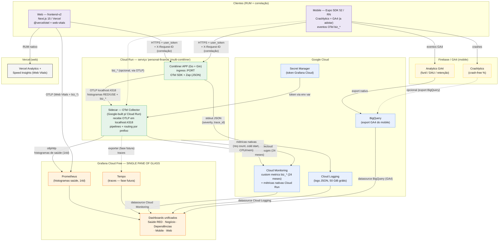
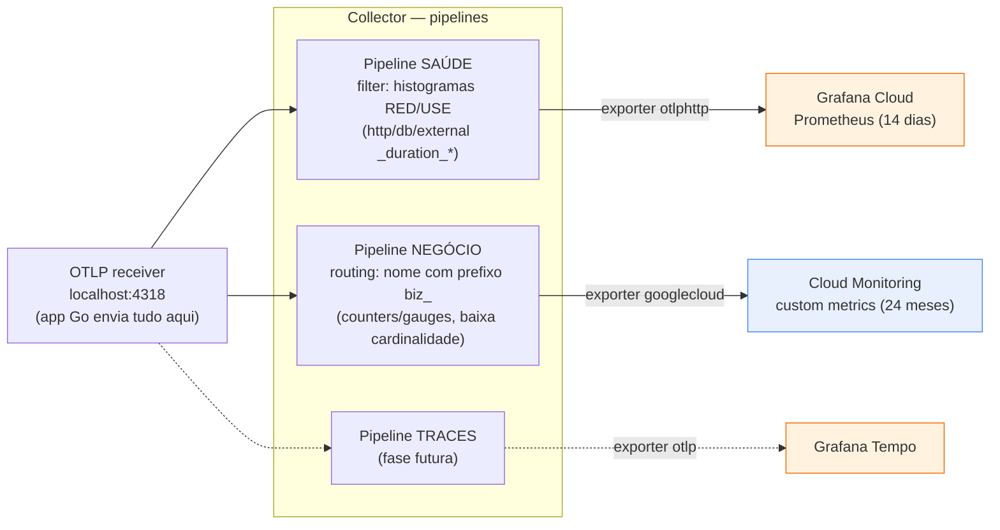

# Diagrama — Infraestrutura de Monitoramento (Observabilidade)

> Companheiro visual do [`AyD-monitoramento.md`](./AyD-monitoramento.md). Reflete as decisões já
> fechadas: OpenTelemetry como contrato comum, **sidecar OTel Collector** no Cloud Run roteando
> por tipo de sinal (**histogramas de saúde → Grafana Cloud (14d)**, **KPIs `biz_*` → Cloud
> Monitoring (24 meses)**), **logs no Cloud Logging**, e **Grafana como single pane of glass**
> lendo tudo por *datasource*. Web/mobile fazem *bridge* só dos KPIs canônicos `biz_*`.

---

## 1. Visão geral — fluxo de ponta a ponta

---

## 2. Detalhe — roteamento de sinais no sidecar Collector

> Regra central: **histograma nunca vai para o Cloud Monitoring** (custa 1 ponto/bucket e estoura
> o free tier). A separação é por **prefixo de nome de métrica** (`biz_*`) e por **tipo** (histogram
> vs counter/gauge), em **pipelines distintos** do Collector.

---

## 3. Legenda de destinos por sinal

| Sinal | Origem | Caminho | Destino final | Retenção / custo |
|---|---|---|---|---|
| **Logs** | App Go (stdout JSON) | Cloud Run → Cloud Logging | Cloud Logging | 50 GiB/mês grátis |
| **Histogramas de saúde** (RED/USE) | App Go → OTLP | Collector (`otlphttp`) | Grafana Cloud (Prometheus) | 14 dias / grátis (10k séries) |
| **KPIs de negócio `biz_*`** | App Go → OTLP | Collector (`googlecloud`) | Cloud Monitoring | 24 meses / ~26% do free tier |
| **Métricas de infra** | Cloud Run nativo | direto | Cloud Monitoring | grátis |
| **Web Vitals + `biz_*` web** | Web (`@vercel/otel`) | OTLP direto | Grafana Cloud | grátis |
| **RUM web (visão rápida)** | Web | nativo | Vercel Analytics | nativo |
| **Crashes mobile** | Mobile | nativo | Crashlytics (Firebase) | grátis |
| **Eventos/funil mobile** | Mobile | GA4 → export | BigQuery → datasource Grafana | sandbox grátis |
| **Traces** (fase futura) | App/clientes → OTLP | Collector | Grafana Tempo | 50 GB / grátis |

> **Single pane:** o **Grafana** abre todos os dashboards lendo Cloud Monitoring + Cloud Logging +
> BigQuery por *datasource*, além do que recebe direto via OTLP (saúde/traces). Os consoles nativos
> (Vercel, Firebase) permanecem como visão complementar — sem duplicar custo.
