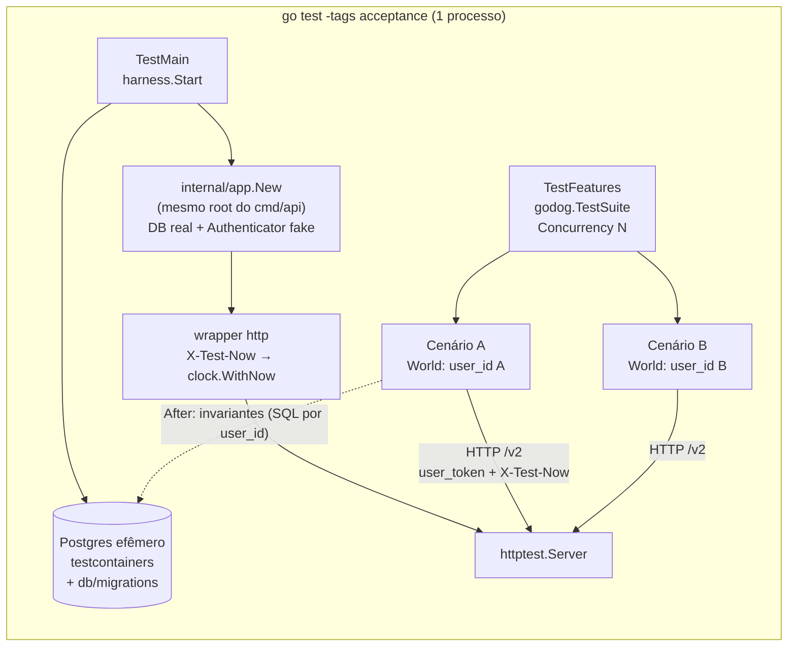

# Spec: Suíte de testes de aceite em Gherkin (parte da api)

> **Doc único deste repo para a feature:** o *o quê* (objetivo, critérios, contratos) e o
> *como* (plano de implementação). A parte "o quê" **congela ao virar `approved`**; a
> checklist do plano segue sendo marcada durante a execução, sem mudar o `status`.

## Objetivo

Criar uma suíte de **testes de aceite em Gherkin** (inglês, executada pelo godog) que sobe
a **própria api in-process** contra um **Postgres efêmero** e exercita, via HTTP nas rotas
`/v2`, **sequências** de operações de negócio — com foco em:

- **update e delete de `Movement` nas duas modalidades** — *one* (`PUT|DELETE /v2/movements/:id`)
  e *all-next* (`PUT|DELETE /v2/movements/:id/all-next`);
- o **cruzamento** disso com `RecurrentMovement` (ocorrência física × virtual, quebra e
  truncamento de cadeia), `CreditCard`/`Invoice` (fatura aberta, paga, parcialmente paga,
  remanescente), parcelamento e `InternalTransfer`.

A infraestrutura (harness, `World`, biblioteca de passos, invariantes) é desenhada para ser
**reaproveitada**: cada nova capacidade de negócio entra como um `.feature` novo usando o
vocabulário existente, e o mesmo harness serve a testes de integração em Go puro.

Decisões técnicas em `TDR-001`. **Sem AYD:** a suíte não cria nem muda contrato — consome os
contratos `/v2` já documentados em `docs/swagger.yaml`. Divergências de contrato que a suíte
revelar (ver § Divergências suspeitas) seguem o fluxo normal: correção em PR próprio e, se
mudar o comportamento observável, registro no contrato.

## Critérios de aceite

```gherkin
Feature: Acceptance test suite

  Scenario: The suite boots the API in-process against an ephemeral database
    Given Docker is available
    When I run "make test-acceptance"
    Then a Postgres container is started and every migration in db/migrations is applied
    And the API is built by the same composition root used by cmd/api
    And no .env file, Firebase project or external gateway credential is required

  Scenario: Unit tests stay independent from Docker
    When I run "make test"
    Then no acceptance package is compiled or executed

  Scenario: Scenarios are isolated by user
    Given two scenarios running concurrently
    Then each one acts as a distinct user
    And neither observes data created by the other

  Scenario: Each scenario has its own frozen clock
    Given a scenario declares "today is 2026-03-10"
    When the API reads the current date for a business rule
    Then it observes 2026-03-10, whatever date other concurrent scenarios declare

  Scenario: Production never honors test overrides
    Given the API is started by cmd/api in any environment
    Then the X-Test-Now header has no effect
    And authentication is performed by Firebase

  Scenario: Global invariants are verified after every scenario
    When any scenario finishes
    Then every invoice amount equals the sum of its items
    And every credit card available limit equals its initial limit plus its unpaid invoices
    And every wallet balance equals its initial balance plus its paid wallet movements
    And every internal transfer has exactly two legs with opposite amounts and the same paid state

  Scenario: An unasserted failure fails the scenario
    Given a step receives a non-2xx response from the API
    When the next step is not "the operation is rejected as ..."
    Then the scenario fails showing the response status and body

  Scenario: Known divergences do not block the pipeline
    Given a scenario tagged @known-bug
    When the default acceptance run executes
    Then that scenario is skipped
    And "make test-acceptance-known-bugs" runs it and reports whether it still fails

  Scenario: The movement matrix is covered
    Then every cell of the coverage matrix in this SPEC has at least one scenario
```

## Contratos consumidos/expostos

**Consumidos** (só leitura do contrato, em `docs/swagger.yaml`; a suíte não redefine nada):

| Recurso | Rotas usadas pela suíte |
|---|---|
| `Wallet` | `POST /v2/wallets`, `GET /v2/wallets/:id` |
| `Category` / `Subcategory` | `POST /v2/categories`, `POST /v2/subcategories` |
| `CreditCard` | `POST /v2/creditcards`, `GET /v2/creditcards/:id`, `PUT /v2/creditcards/:id` |
| `Movement` | `POST /v2/movements`, `GET /v2/movements?from&to`, `PUT /v2/movements/:id`, `PUT /v2/movements/:id/all-next`, `DELETE /v2/movements/:id?date`, `DELETE /v2/movements/:id/all-next?date`, `POST /v2/movements/:id/pay?date`, `POST /v2/movements/:id/revert-pay` |
| `Invoice` | `GET /v2/invoices/detailed?from&to`, `GET /v2/invoices/:id`, `POST /v2/invoices/:id/pay`, `POST /v2/invoices/:id/revert-pay`, `POST /v2/invoices/:id/recalculate` |
| `InternalTransfer` | `POST /v2/transfers`, `PUT /v2/transfers/:pair_id`, `DELETE /v2/transfers/:pair_id`, `POST /v2/transfers/:pair_id/pay`, `POST /v2/transfers/:pair_id/revert-pay` |
| `Limits` | `GET /me/limits` (cenários de plano `free`) |

**Expostos:** nenhum. O header `X-Test-Now` e o formato de `user_token` da auth fake
existem **só no harness** (wrapper/`Authenticator` de teste); a api de produção não os
conhece.

## Modelo de dados / componentes afetados

- **Nenhuma mudança de schema.** Nenhuma migration nova.
- **Código de produção (refactor sem mudança de comportamento):**
  - `internal/app` (novo) — composition root extraído de `cmd/api/main.go`.
  - `pkg/clock` (novo) — `clock.Now(ctx)` / `clock.WithNow(ctx, t)`.
  - `internal/bootstrap/environment` — constante `Test = "test"`.
  - Leituras de "hoje" de regra de negócio migram para `clock.Now(ctx)` (lista no plano).
- **Código de teste (novo):** `test/acceptance/**` (harness, world, steps, features).
- **Build/CI:** `Makefile` (alvos `test-acceptance*`), `.code_quality/.golangci.yml`
  (`build-tags: [acceptance]`), `.gitignore` (relatórios), `.github/workflows/acceptance.yml`.

## Casos de borda & fora de escopo

- **Borda — leituras fora da transação:** vários repositórios leem pelo `*gorm.DB` raiz
  mesmo dentro de `WithTransaction`. Entre cenários não há interferência (usuários
  distintos); dentro de um cenário os passos são sequenciais. A suíte não testa concorrência
  intra-usuário.
- **Borda — valores em `float64`:** toda comparação de valor arredonda para centavos.
- **Borda — datas/fuso:** todas as datas da suíte são UTC; `X-Test-Now` em UTC; meses
  `yyyy-mm` resolvem para `[dia 1, último dia]` em UTC.
- **Borda — categorias default** (`user_id = default_category_id`, ex.: a categoria de
  pagamento de fatura semeada na migration 008) são compartilhadas e só lidas; os cenários
  criam as próprias categorias para não depender do seed.
- **Borda — banco reaproveitado** (`ACCEPTANCE_DATABASE_URL`): dados de execuções anteriores
  não interferem (isolamento por usuário); migrations `up` são idempotentes.
- **Borda — Docker indisponível:** `TestMain` falha rápido com mensagem explícita (sem
  "skip" silencioso).
- **Borda — `LazyProvisionUser`:** cada cenário provisiona uma linha em `users`, como em
  produção no primeiro request.
- **Fora:** rotas legacy (`/movements`, `/wallets`...) — decidido cobrir só `/v2`.
- **Fora:** import de `Statement`, `Agent`, `Subscription`/webhooks, push, export, admin —
  dependem de gateways externos; entram depois com fakes no mesmo harness.
- **Fora:** corrigir as divergências que a suíte revelar — cada correção é PR próprio; esta
  SPEC só as expõe (com `@known-bug`).
- **Fora:** validação de schema contra `docs/swagger.yaml` e testes de carga.
- **Fora:** job de CI de unit tests (trivial de somar ao mesmo workflow depois).

---

## Plano de implementação

> Parte de trabalho deste doc. Decisão técnica não trivial vira TDR (`TDR-001`).

### Abordagem técnica



Ciclo de vida em três níveis:

| Nível | Quando | O que acontece |
|---|---|---|
| **Processo** | `TestMain` | sobe o Postgres (ou usa `ACCEPTANCE_DATABASE_URL`), roda migrations, monta a app via `app.New`, sobe `httptest.Server`. Uma vez só. |
| **Cenário** | `Before` / `After` do godog | `Before`: cria um `World` com `user_id` novo e "hoje" padrão (`2026-01-15T12:00:00Z`). `After`: roda as invariantes globais para esse `user_id`. |
| **Passo** | cada step | resolve aliases no `World`, chama a API, guarda a resposta; asserções leem a API (e o banco só nas invariantes). |

### Mudanças no código de produção (fase 0)

**1. `internal/app` — composition root único.** Tudo o que hoje está em `setupGin` + o
wiring legacy + `SetupCleanArchComponents` sai de `cmd/api/main.go`:

```go
package app

type Config struct {
	DB            *gorm.DB
	Authenticator authentication.Authenticator
	Logger        log.Logger
}

// New monta o *gin.Engine completo (recovery, logger, métricas HTTP, CORS, health, /ping,
// jobs, rotas públicas, auth + LazyProvisionUser, rotas legacy e clean-arch). É o único
// composition root: cmd/api e a suíte de aceite montam a app por aqui.
func New(cfg Config) (*gin.Engine, error)
```

`cmd/api/main.go` fica com: `godotenv` → logger → meter provider → `InitializeDatabase` →
`NewFirebaseAuth` → `app.New` → `r.Run()`. O `authentication.NewFirebaseAuth()` sai de
dentro do `setupGin` e passa a ser injetado — é isso que permite a auth fake.

**2. `pkg/clock` — relógio no contexto.**

```go
package clock

type nowKey struct{}

// WithNow fixa o "agora" visto por clock.Now neste contexto.
func WithNow(ctx context.Context, now time.Time) context.Context {
	return context.WithValue(ctx, nowKey{}, now)
}

// Now devolve o "agora" do contexto, ou time.Now() quando não há override.
func Now(ctx context.Context) time.Time {
	if now, ok := ctx.Value(nowKey{}).(time.Time); ok {
		return now
	}
	return time.Now()
}
```

Em produção ninguém chama `WithNow` → comportamento idêntico ao atual. Migram **só as
leituras de regra de negócio** (auditoria `date_create`/`date_update`/`created_at` fica em
`time.Now()` e nunca é asserida):

| Call site | Regra |
|---|---|
| `internal/usecase/invoice_usecase.go:226` | `payment_date` padrão do pagamento de fatura |
| `internal/usecase/limits_usecase.go:64` | mês corrente em `GET /me/limits` |
| `internal/bootstrap/registry/plan_limits_validator.go:93,118` | contagem mensal de `Movement`/recorrência no plano `free` |
| `internal/infrastructure/repository/wallet_repository.go:36-38` | `initial_date` padrão da `Wallet` |
| `internal/infrastructure/repository/wallet_repository.go:173` | limite superior do recálculo de saldo |
| `internal/domain/balance.go:24` (`Period.Validate`) | `from`/`to` padrão — ganha `ValidateAt(now time.Time)`; os callers `/v2` (`movement_api.go`, `invoice_api.go`, `dashboard_usecase.go`, `balance_usecase.go`) passam `clock.Now(ctx)`; `Validate()` continua (legacy) chamando `ValidateAt(time.Now())` |

Fora da lista (sem cenário nesta SPEC): `subscription`, `coupon`, `agent`, `export` — migram
quando ganharem cenários.

**3. `environment.Test = "test"`.** O harness define `ENVIRONMENT=test` (gin em modo de
teste, log em texto) e **se recusa a subir** se `ENVIRONMENT=production`. Nenhum usecase ou
repositório consulta o ambiente.

### Harness (`test/acceptance/harness`)

| Arquivo | Responsabilidade |
|---|---|
| `harness.go` | `Start(ctx) (*Env, error)` / `Env.Close()`; `Env{BaseURL string; DB *gorm.DB}`. |
| `postgres.go` | testcontainers-go (`modules/postgres`), imagem do `docker-compose.yaml`, `WithUsername("silvioubaldino")` (as migrations fazem `owner to silvioubaldino`), `ConnectionString(ctx, "sslmode=disable")`; ou `ACCEPTANCE_DATABASE_URL`. Roda `database.RunMigrations` e abre via `database.OpenGORMConnection`. |
| `paths.go` | raiz do repo via `runtime.Caller` → `file://<raiz>/db/migrations` (o `go test` roda com cwd = pacote, então `GetMigrationsPath()` relativo não serve). |
| `testauth.go` | `Authenticator` fake: `user_token` = `<user_id>` ou `<user_id>;plan=free`; monta `AuthContext` (plano `plus` padrão, role `user`) e grava `authentication.UserID` no contexto (os repositórios fazem `ctx.Value(UserID).(string)`). `AuthClient()` devolve `nil` (`LazyProvisionUser` e os gateways já toleram). `DeleteUser` no-op. |
| `app.go` | `app.New(app.Config{DB, Authenticator: testauth, Logger})` + wrapper `http.Handler` que lê `X-Test-Now` (RFC 3339) e aplica `clock.WithNow` antes do gin + `httptest.NewServer`. |
| `client.go` | cliente HTTP tipado: injeta `user_token` e `X-Test-Now` do cenário; `Do(method, path, body) Response{Status, Body}`; decodifica em **structs próprias** que espelham o JSON do contrato (não importa `internal/domain/output`). |

Entrada da suíte (`test/acceptance/acceptance_test.go`, `//go:build acceptance`):

```go
var env *harness.Env

func TestMain(m *testing.M) {
	var err error
	if env, err = harness.Start(context.Background()); err != nil {
		fmt.Fprintln(os.Stderr, "acceptance: cannot start harness:", err)
		os.Exit(1)
	}
	code := m.Run()
	env.Close()
	os.Exit(code)
}

func TestFeatures(t *testing.T) {
	suite := godog.TestSuite{
		Name:                "acceptance",
		ScenarioInitializer: steps.Initialize(env),
		Options: &godog.Options{
			Paths:       []string{"features"},
			Format:      "pretty,junit:reports/acceptance-junit.xml,cucumber:reports/acceptance-cucumber.json",
			Tags:        envOr("GODOG_TAGS", "~@known-bug && ~@wip"),
			Concurrency: envIntOr("GODOG_CONCURRENCY", 4),
			Randomize:   -1, // ordem aleatória: flagra dependência escondida entre cenários
			Strict:      true, // passo indefinido/pendente falha
			TestingT:    t,
		},
	}
	if suite.Run() != 0 {
		t.Fatal("acceptance scenarios failed")
	}
}
```

### Estado por cenário (`test/acceptance/world`)

```go
type World struct {
	UserID string
	Plan   string    // "plus" (padrão) | "free"
	Now    time.Time // vira X-Test-Now em todo request

	wallets    map[string]WalletRef   // alias → id + initial_balance (para invariante I3)
	cards      map[string]CardRef     // alias → id + limite inicial (para invariante I2)
	categories map[string]uuid.UUID
	movements  map[string]MovementRef // alias → avulso | série | parcelado | transferência

	last         *harness.Response // última resposta de um passo de ação
	lastAsserted bool
}
```

- O `World` viaja no `context.Context` que o godog passa de passo em passo — nada global,
  seguro com `Concurrency > 1`.
- **Aliases:** o Gherkin fala em nomes (`"Checking"`, `"Nubank"`, `"Gym"`, `"TV"`); o
  `World` resolve para IDs.
- **Série recorrente = linhagem de descrições.** Update/delete quebram a cadeia e criam
  `recurrent_id` novos, e a api não expõe a ligação entre eles. O alias de uma série guarda
  o **conjunto de descrições** que ela já teve; `the occurrence of "Gym" in "2026-06"` é o
  único movimento recorrente do mês (físico ou virtual) cuja descrição pertence ao
  conjunto. Um update que troca a descrição acrescenta a nova ao conjunto. Duas ou mais
  ocorrências do mesmo mês é erro da suíte (e acusa duplicata). Regra de escrita: séries de
  um mesmo cenário têm descrições distintas.
- **Parcelado:** o alias guarda o `installment_group_id` devolvido na criação;
  `installment 2 of "TV"` resolve pelas faturas detalhadas.
- **Ocorrência virtual:** `GET /v2/movements` devolve ocorrências não materializadas com
  `id = recurrent_id`; a resolução devolve esse id e a data da ocorrência (exigida por
  `DELETE ...?date=`).
- **Updates enviam o movimento completo** (estado lido + campos da tabela sobrepostos),
  como web/mobile fazem — o `PUT .../all-next` não faz merge com o estado atual.

**Regra da resposta não asserida:** passos de ação nunca falham por status; guardam a
resposta. Se ela não for 2xx e o **próximo** passo não for `the operation is rejected as
...`, esse próximo passo falha mostrando status e corpo. Vale igual para `Given` (setup que
falha derruba o cenário no passo seguinte) e garante que nenhuma falha passe calada.

### Organização dos cenários

**Por capacidade de negócio**, um arquivo por comportamento; tags fazem os recortes
transversais.

```
test/acceptance/
├── acceptance_test.go
├── harness/      harness.go postgres.go paths.go testauth.go app.go client.go
├── world/        world.go refs.go lineage.go
├── steps/
│   ├── register.go          # Initialize(env): Before/After + registra os grupos abaixo
│   ├── context_steps.go     # hoje, plano
│   ├── wallet_steps.go
│   ├── category_steps.go
│   ├── creditcard_steps.go
│   ├── movement_steps.go    # criar, pagar, update/delete one|all-next (avulso/série/parcela)
│   ├── invoice_steps.go
│   ├── transfer_steps.go
│   ├── assertion_steps.go   # succeeds/rejected, saldo, limite, fatura, ocorrências, listagens
│   └── invariants.go        # I1–I4 (After)
├── features/
│   ├── wallet/
│   │   └── wallet_balance.feature
│   ├── movement/
│   │   ├── create_movement.feature
│   │   ├── pay_movement.feature
│   │   ├── update_one_movement.feature
│   │   ├── update_all_next_movement.feature
│   │   ├── delete_one_movement.feature
│   │   └── delete_all_next_movement.feature
│   ├── recurrence/
│   │   ├── recurrent_projection.feature
│   │   ├── update_one_recurrent.feature
│   │   ├── update_all_next_recurrent.feature
│   │   ├── delete_one_recurrent.feature
│   │   └── delete_all_next_recurrent.feature
│   ├── credit_card/
│   │   ├── purchase_invoice_assignment.feature
│   │   ├── installments.feature
│   │   ├── invoice_payment.feature          # total, parcial (remanescente), revert
│   │   ├── update_credit_card_movement.feature
│   │   ├── delete_credit_card_movement.feature
│   │   ├── paid_invoice_protection.feature
│   │   └── recurrent_credit_card.feature
│   ├── transfer/
│   │   └── internal_transfer.feature
│   └── journeys/
│       ├── credit_card_month_cycle.feature
│       └── salary_and_bills_cycle.feature
└── reports/      (gitignored)
```

**Tags:**

| Tag | Uso |
|---|---|
| `@movement` `@recurrence` `@credit-card` `@invoice` `@installments` `@transfer` `@wallet` | capacidade |
| `@update-one` `@update-all-next` `@delete-one` `@delete-all-next` | modalidade — fatiar a matriz (`GODOG_TAGS=@update-all-next`) |
| `@invoice-paid` `@paid` `@virtual-occurrence` | contexto de estado |
| `@journey` | jornadas longas |
| `@known-bug` | comportamento desejado que hoje diverge — fora do gate de CI |
| `@wip` | em construção — fora do gate de CI |

### Estilo de escrita

- **Inglês, declarativo, termos do glossário** (`wallet`, `credit card`, `invoice`,
  `movement`, `recurrent`, `installment`, `internal transfer`). Sem HTTP no Gherkin.
- **Um comportamento por cenário**; `Background` só para o cenário-base da feature;
  `Scenario Outline` para matrizes.
- **Datas sempre explícitas** (`"2026-03-10"`, mês `"2026-03"`); nenhum cenário depende do
  dia real.
- **Valores:** frases usam `expense`/`income` com valor absoluto; **tabelas usam o valor com
  sinal**, exatamente como a api grava (despesa negativa).
- **Cenários independentes:** nada de cenário que depende de outro; reuso é pelo
  vocabulário de passos.
- **Mudança de data no meio de jornada:** `it is now "2026-03-12"` (não um segundo `Given`).

### Biblioteca de passos (vocabulário)

`<ref>` = `"<alias>"` (avulso/compra) · `the occurrence of "<serie>" in "<yyyy-mm>"` ·
`installment <k> of "<compra>"`.

| Grupo | Passo | Efeito |
|---|---|---|
| Contexto | `today is "<date>"` · `it is now "<date>"` | define `X-Test-Now` (padrão `2026-01-15T12:00:00Z`) |
| | `I am on the free plan` | token com `plan=free` (padrão `plus`, sem `Limits`) |
| Cadastro | `a wallet "<W>" with balance <n>` | `POST /v2/wallets` |
| | `an expense category "<C>"` · `an income category "<C>"` · `a subcategory "<S>" of "<C>"` | categorias do usuário do cenário |
| | `a credit card "<K>" with limit <n>, closing day <d> and due day <d>, paid from wallet "<W>"` | `POST /v2/creditcards`; guarda limite inicial |
| Movimento | `(I add )?a pending\|paid expense\|income "<M>" of <n> on "<date>" in wallet "<W>" under category "<C>"` | avulso |
| | `(I add )?a pending\|paid monthly recurrent expense\|income "<R>" of <n> starting "<date>" in wallet "<W>" under category "<C>"` | série (`is_recurrent: true`) |
| | `(I make )?a credit card purchase "<M>" of <n> on "<date>" on card "<K>" under category "<C>"` | compra à vista |
| | `(I make )?a credit card purchase "<M>" in <k> installments of <n> starting "<date>" on card "<K>" under category "<C>"` | parcelada |
| | `I pa(y\|id) <ref>( on "<date>")?` · `I revert the payment of <ref>` | `pay` / `revert-pay` |
| | `I update only <ref> with:` + tabela · `I update <ref> and all next with:` + tabela | `PUT /:id` · `PUT /:id/all-next`; campos: `description`, `amount`, `date`, `wallet`, `category`, `subcategory` |
| | `I update only <ref> setting amount to <n>` · `I update <ref> and all next setting amount to <n>` | forma curta (cabe em `Scenario Outline`) |
| | `I delete only <ref>` · `I delete <ref> and all next` | `DELETE /:id?date` · `DELETE /:id/all-next?date` |
| Fatura | `I pa(y\|id) the invoice of card "<K>" due in "<yyyy-mm>" from wallet "<W>"( paying <n>)?` | total ou parcial |
| | `I revert the payment of the invoice of card "<K>" due in "<yyyy-mm>"` · `I recalculate the invoice of card "<K>" due in "<yyyy-mm>"` | |
| Transferência | `(I add )?a pending\|paid internal transfer "<T>" of <n> from "<W1>" to "<W2>" on "<date>"` | `POST /v2/transfers` |
| | `I pay\|delete the internal transfer "<T>"` · `I revert the payment of the internal transfer "<T>"` · `I update the internal transfer "<T>" with:` + tabela | rotas `/:pair_id` |
| Resultado | `the operation succeeds` · `the operation is rejected as "<reason>"` | `invalid input`→400 · `not found`→404 · `forbidden`→403 · `conflict`→409 · `insufficient balance`→422 · `insufficient limit`→422 |
| Asserção | `the balance of wallet "<W>" is <n>` · `the available limit of card "<K>" is <n>` | |
| | `the invoice of card "<K>" due in "<m>" has amount <n>` · `... is paid\|open` · `... does not exist` | |
| | `the invoices of card "<K>" are:` (`due`/`amount`/`paid`) · `the invoice of card "<K>" due in "<m>" contains:` (`description`/`amount`/`installment`) | igualdade exata do conjunto |
| | `the occurrences of "<R>" are:` (`month`/`amount`/`paid`, opcional `description`) · `there is no occurrence of "<R>" in "<m>"` | |
| | `<ref> is paid\|pending` · `the movements of wallet "<W>" in "<m>" are:` (`description`/`amount`/`paid`) | |

Passos novos entram no grupo da capacidade; frase nova só quando nenhuma existente
expressa o comportamento (o vocabulário é a API de reuso da suíte).

### Invariantes globais (`After` de todo cenário)

Verificadas por SQL escopado no `user_id` do cenário (a api não expõe esses agregados):

| # | Invariante | Pega |
|---|---|---|
| **I1** | `invoices.amount` = Σ `movements.amount` da fatura (exceto `invoice_payment`) — a mesma regra do `/recalculate` | update/delete que mexe no item e esquece a fatura |
| **I2** | `credit_cards.credit_limit` (disponível) = limite inicial do `World` + Σ `amount` das faturas **não pagas** do cartão | limite que não volta/volta em dobro (vale com pagamento parcial e remanescente) |
| **I3** | `wallets.balance` = `initial_balance` + Σ `amount` dos movimentos **pagos** da carteira, exceto `credit_card` e `invoice_remainder` | saldo que deriva em update/delete de pago, pagamento/revert de fatura |
| **I4** | todo `pair_id` tem **2** pernas, valores opostos, mesmo `is_paid`, carteiras distintas | update/delete que quebra a transferência pela metade |

Comparação em centavos. Falha de invariante falha o cenário com o diff (esperado × atual).

### Matriz de cobertura (comportamento desejado)

Cada célula vira ao menos um cenário. `⚠ Kn` = suspeita de divergência (§ seguinte) →
cenário nasce `@known-bug` se a fase de execução confirmar.

| Contexto \ operação | update one | update all-next | delete one | delete all-next |
|---|---|---|---|---|
| **Avulso pendente** | só ele muda; saldo intacto | igual ao update one | some; saldo intacto | igual ao delete one |
| **Avulso pago** | saldo ajusta pela diferença; troca de carteira estorna na antiga e lança na nova | igual ao update one | some; saldo estornado | igual ao delete one |
| **Série — 1ª ocorrência (física)** | só o mês muda; meses seguintes mantêm valores | série inteira muda; cadeia antiga aposentada | some o mês; série continua do mês seguinte | série inteira some |
| **Série — ocorrência virtual do meio** | mês materializado com valores novos; vizinhos intactos | do mês em diante muda; meses anteriores intactos | só o mês some (lacuna); série continua | do mês em diante some |
| **Série — ocorrência paga** | saldo ajusta pela diferença; demais meses intactos | saldo ajusta só no mês pago; seguintes (pendentes) com valor novo | saldo estornado; série continua | saldo estornado; série termina no mês anterior |
| **Compra em fatura aberta** | fatura e limite ajustam pelo delta | igual ao update one ⚠ K4 | fatura e limite restaurados | igual ao delete one |
| **Compra em fatura paga** | rejeitado (`conflict`) ⚠ K1 | rejeitado (`conflict`) ⚠ K4 | rejeitado (`conflict`) ⚠ K1 | rejeitado (`conflict`) ⚠ K1 |
| **Parcela k de n (faturas abertas)** | só a parcela k e sua fatura | parcelas k..n e suas faturas ⚠ K5 | só a parcela k e sua fatura | parcelas k..n somem; faturas e limite restaurados |
| **Parcela k com fatura de k+1 paga** | permitido (fatura de k aberta) | rejeitado inteiro, nada muda (`conflict`) ⚠ K1 | permitido | rejeitado inteiro, nada muda (`conflict`) ⚠ K1 |
| **Despesa recorrente no cartão** | a decidir ⚠ K6 K9 | a decidir ⚠ K9 | a decidir ⚠ K6 | a decidir ⚠ K7 |
| **Perna de transferência** (rota de movimento) | rejeitado (`invalid input`) | rejeitado (`invalid input`) ⚠ K3 | rejeitado (`invalid input`) | rejeitado (`invalid input`) ⚠ K2 |

Fora da matriz, cada feature cobre também: pagamento de fatura total/parcial/revert
(com e sem remanescente), saldo insuficiente (`422`), valor de pagamento fora da faixa,
pagar/reverter movimento já pago/pendente, compra sem carteira padrão no cartão, limite
insuficiente, troca de data que muda o mês/fatura, subcategoria que não pertence à
categoria (`400`), limites do plano `free`.

### Divergências suspeitas (leitura do código em 2026-10-02)

Hipóteses levantadas lendo o código para escrever esta SPEC — **não estão confirmadas**. A
fase 2/3 roda o cenário de cada uma: confirmada → cenário `@known-bug` + issue; não
reproduz → cenário normal.

| # | Suspeita | Onde | Invariante/efeito |
|---|---|---|---|
| **K1** | Erros sem mapeamento em `HandleErr` caem em `500`: `ErrInvoiceAlreadyPaid`, `ErrInvoiceNotPaid`, `ErrInvoiceCannotModify`, `ErrCreditMovementShouldNotBePaid`, `ErrInsufficientCreditLimit`, `ErrCreditCardPay`, `ErrInvalidPaymentAmount`, `ErrUnsupportedMovementTypeV2` | `errors_handler.go` | regra de negócio rejeitada responde "Internal server error" |
| **K2** | `DELETE /:id/all-next` numa perna de transferência não tem o guard `ErrTransferMustUsePairEndpoint` (o `DELETE /:id` tem) → apaga uma perna só | `deleteallnext_movement_usecase.go` | quebra I4 |
| **K3** | `PUT /:id/all-next` numa perna de transferência também não tem o guard → atualiza uma perna só | `updateallnext_movement_usecase.go` | quebra I4 / I3 |
| **K4** | `PUT /:id/all-next` em compra de cartão **não recorrente** vai para `updateSingleMovement`, que não ajusta fatura/limite nem checa fatura paga (e em item pago chama `handlePaid`, debitando a carteira) | `updateallnext_movement_usecase.go` | quebra I1 / I2 / I3 |
| **K5** | `PUT /:id/all-next` em parcela não propaga para as parcelas seguintes (o `DELETE .../all-next` propaga) | idem | comportamento desejado a confirmar |
| **K6** | `DELETE /:id` de um movimento de cartão com `recurrent_id` apaga o físico sem quebrar a cadeia → a ocorrência virtual pode reaparecer no mesmo mês | `deleteone_movement_usecase.go` | depende de K9 |
| **K7** | `DELETE /:id/all-next` de movimento de cartão recorrente não trunca a cadeia | `deleteallnext_movement_usecase.go` | depende de K9 |
| **K8** | A fatura criada por `FindOrCreateInvoiceForMovement` usa transação própria: se o request falha depois (ex.: `ErrCreditCardNoDefaultWallet`), sobra fatura vazia | `invoice_usecase.go` / `movement_usecase.go` | fatura órfã |
| **K9** | `POST /v2/movements` de cartão com `is_recurrent: true` ignora a recorrência (o ramo de cartão retorna antes de `ShouldCreateRecurrent`) — não está claro como nasce "recorrente no cartão" | `movement_usecase.go` | define a coluna "recorrente no cartão" |
| **K10** | `DeleteAllByRecurrentID` não filtra por `user_id` (risco baixo: UUID) | `movement_repository.go` | multi-tenant |

Confirmadas pela execução na fase 2 (cenários `@known-bug` em `features/recurrence/`):

| # | Divergência confirmada | Onde | Efeito |
|---|---|---|---|
| **K11** | `DELETE /:id` da **1ª ocorrência** faz `DeleteAllByRecurrentID` na cadeia antiga e apaga **também** ocorrências materializadas de meses posteriores (editadas ou pagas); as pagas somem **sem estorno** | `deleteone_movement_usecase.go` (`splitRecurrentChain`) | perde dado de outro mês; quebra I3 |
| **K12** | `DELETE /:id/all-next` numa ocorrência do meio **não remove** ocorrências já materializadas dos meses seguintes (paga em adiantado fica e o saldo não é estornado); da **1ª** ocorrência, remove-as **sem estorno** | `deleteallnext_movement_usecase.go` (`truncateRecurrentChain`) | saldo errado; quebra I3 |
| **K13** | `PUT /:id/all-next` não reaponta ocorrências materializadas posteriores à nova cadeia: a paga fica na cadeia antiga **e** a nova projeta a virtual do mesmo mês (duplicata); da **1ª** ocorrência, `DeleteAllByRecurrentID` apaga a paga sem estorno | `updateallnext_movement_usecase.go` (`updateAllNextRecurrent`) | ocorrência duplicada / perdida; quebra I3 |

**Corrigir K1 muda status HTTP observável** (500 → 4xx): a correção registra o novo
comportamento no contrato (`docs/swagger.yaml`) no próprio PR de correção.

### Questões em aberto (decisão de produto antes de escrever os cenários afetados)

1. **K5** — update all-next numa parcela k deve reescrever k..n?
2. **K6/K7/K9** — "despesa recorrente no cartão" é um caso suportado? Se sim, como nasce e
   o que delete one/all-next fazem com a cadeia?
3. **K1** — status desejado: `409` para estado (fatura paga/não paga, movimento de cartão
   pago), `422` para limite insuficiente, `400` para valor de pagamento fora da faixa?

### Exemplos de features

**1. Série — update all-next** (`features/recurrence/update_all_next_recurrent.feature`)

```gherkin
@recurrence @update-all-next
Feature: Update a recurrent movement from an occurrence onwards
  Updating an occurrence "and all next" rewrites the series from that month on,
  leaving the earlier months untouched.

  Background:
    Given today is "2026-01-15"
    And a wallet "Checking" with balance 1000.00
    And an expense category "Sports"
    And a pending monthly recurrent expense "Gym" of 100.00 starting "2026-01-10" in wallet "Checking" under category "Sports"

  @virtual-occurrence
  Scenario: Updating a future occurrence and all next
    When I update the occurrence of "Gym" in "2026-03" and all next with:
      | amount | -120.00 |
    Then the operation succeeds
    And the occurrences of "Gym" are:
      | month   | amount  | paid |
      | 2026-01 | -100.00 | no   |
      | 2026-02 | -100.00 | no   |
      | 2026-03 | -120.00 | no   |
      | 2026-12 | -120.00 | no   |
    And the balance of wallet "Checking" is 1000.00

  Scenario: Updating the first occurrence and all next rewrites the whole series
    When I update the occurrence of "Gym" in "2026-01" and all next with:
      | amount      | -120.00     |
      | description | Gym premium |
    Then the operation succeeds
    And the occurrences of "Gym" are:
      | month   | amount  | description | paid |
      | 2026-01 | -120.00 | Gym premium | no   |
      | 2026-06 | -120.00 | Gym premium | no   |

  @paid
  Scenario: Updating a paid occurrence and all next adjusts the wallet by the difference
    Given I paid the occurrence of "Gym" in "2026-01"
    When I update the occurrence of "Gym" in "2026-01" and all next with:
      | amount | -120.00 |
    Then the operation succeeds
    And the balance of wallet "Checking" is 880.00
    And the occurrences of "Gym" are:
      | month   | amount  | paid |
      | 2026-01 | -120.00 | yes  |
      | 2026-02 | -120.00 | no   |
```

**2. Fatura paga congela os itens — matriz** (`features/credit_card/paid_invoice_protection.feature`)

```gherkin
@credit-card @invoice-paid
Feature: Purchases in a paid invoice are frozen
  Once an invoice is paid its purchases cannot be changed or removed;
  the user has to revert the invoice payment first.

  Background:
    Given today is "2026-03-20"
    And a wallet "Checking" with balance 3000.00
    And an expense category "Home"
    And a credit card "Nubank" with limit 5000.00, closing day 5 and due day 12, paid from wallet "Checking"
    And a credit card purchase "Lamp" of 200.00 on "2026-03-03" on card "Nubank" under category "Home"
    And I paid the invoice of card "Nubank" due in "2026-03" from wallet "Checking"

  @known-bug
  Scenario Outline: Changing a purchase of a paid invoice is rejected
    When I <action>
    Then the operation is rejected as "conflict"
    And the invoice of card "Nubank" due in "2026-03" has amount -200.00
    And the available limit of card "Nubank" is 5000.00
    And the balance of wallet "Checking" is 2800.00

    Examples:
      | action                                              |
      | update only "Lamp" setting amount to -250.00        |
      | update "Lamp" and all next setting amount to -250.00 |
      | delete only "Lamp"                                  |
      | delete "Lamp" and all next                          |
```

(Pela leitura do código: as linhas 1, 3 e 4 respondem `500` — K1; a linha 2 **passa** e
debita 50,00 da carteira — K4. O `@known-bug` sai linha a linha conforme as correções.)

**3. Jornada do cartão** (`features/journeys/credit_card_month_cycle.feature`)

```gherkin
@journey @credit-card @installments
Feature: A month in the life of a credit card

  Scenario: Buy in installments, pay the invoice, cancel the remaining installments and revert the payment
    Given today is "2026-03-01"
    And a wallet "Checking" with balance 3000.00
    And an expense category "Electronics"
    And a credit card "Nubank" with limit 5000.00, closing day 5 and due day 12, paid from wallet "Checking"

    When I make a credit card purchase "TV" in 3 installments of 400.00 starting "2026-03-03" on card "Nubank" under category "Electronics"
    And I make a credit card purchase "Shoes" of 300.00 on "2026-03-10" on card "Nubank" under category "Electronics"
    Then the available limit of card "Nubank" is 3500.00
    And the invoices of card "Nubank" are:
      | due     | amount  | paid |
      | 2026-03 | -400.00 | no   |
      | 2026-04 | -700.00 | no   |
      | 2026-05 | -400.00 | no   |

    When it is now "2026-03-12"
    And I pay the invoice of card "Nubank" due in "2026-03" from wallet "Checking"
    Then the balance of wallet "Checking" is 2600.00
    And the available limit of card "Nubank" is 3900.00
    And installment 1 of "TV" is paid

    When I delete installment 2 of "TV" and all next
    Then the invoices of card "Nubank" are:
      | due     | amount  | paid |
      | 2026-03 | -400.00 | yes  |
      | 2026-04 | -300.00 | no   |
      | 2026-05 |    0.00 | no   |
    And the available limit of card "Nubank" is 4700.00

    When I revert the payment of the invoice of card "Nubank" due in "2026-03"
    Then the balance of wallet "Checking" is 3000.00
    And the available limit of card "Nubank" is 4300.00
    And the invoice of card "Nubank" due in "2026-03" is open
```

### Execução

| Alvo / variável | Efeito |
|---|---|
| `make test-acceptance` | `go test -tags acceptance -count=1 ./test/acceptance/...` com `~@known-bug && ~@wip` |
| `make test-acceptance-wip` | só `@wip`, saída verbosa — para escrever cenário novo |
| `make test-acceptance-known-bugs` | só `@known-bug`; um cenário que **passar** indica bug corrigido → tirar a tag |
| `GODOG_TAGS` | expressão de tags do godog (ex.: `@update-all-next && @credit-card`) |
| `GODOG_CONCURRENCY` | cenários em paralelo (padrão 4) |
| `ACCEPTANCE_DATABASE_URL` | usa um Postgres existente em vez do container |
| `ACCEPTANCE_LOG_LEVEL` | log da app durante a suíte (padrão `error`) |

`.code_quality/.golangci.yml` ganha `run.build-tags: [acceptance]` (senão o lint não enxerga
a suíte). `test/acceptance/reports/` vai para o `.gitignore`.

### CI (`.github/workflows/acceptance.yml`)

```yaml
name: acceptance
on:
  push:
  workflow_dispatch:
jobs:
  acceptance:
    runs-on: ubuntu-latest      # Docker nativo → testcontainers funciona sem configuração
    timeout-minutes: 20
    steps:
      - uses: actions/checkout@v4
      - uses: actions/setup-go@v5
        with:
          go-version-file: go.mod
      - run: make test-acceptance
      - uses: actions/upload-artifact@v4
        if: always()
        with:
          name: acceptance-reports
          path: test/acceptance/reports/
  known-bugs:
    runs-on: ubuntu-latest
    continue-on-error: true     # informativo: não bloqueia o push
    steps:
      - uses: actions/checkout@v4
      - uses: actions/setup-go@v5
        with:
          go-version-file: go.mod
      - run: make test-acceptance-known-bugs
```

### Passos

**Fase 0 — Fundação no código de produção (refactor, sem mudança de comportamento)**
1. Extrair `internal/app.New` de `cmd/api/main.go` (inclui rotas legacy); `main.go` fino;
   `Authenticator` injetado.
2. `environment.Test`.
3. `pkg/clock` + unit tests; migrar os call sites da tabela; `Period.ValidateAt`; ajustar os
   unit tests afetados.
4. `make all` verde; smoke local (`/ping`, um `GET /v2/wallets` autenticado).

**Fase 1 — Harness + smoke**
5. `go get` de `github.com/cucumber/godog` e `github.com/testcontainers/testcontainers-go`
   (+ `modules/postgres`).
6. Harness (`postgres.go`, `paths.go`, `testauth.go`, `app.go`, `client.go`, `harness.go`).
7. `World`, hooks, regra da resposta não asserida, esqueleto das invariantes.
8. Passos de contexto, carteira e categoria; `features/wallet/wallet_balance.feature` verde.
9. Alvos do `Makefile`, `build-tags` do lint, `.gitignore` de relatórios.

**Fase 2 — Matriz de movimento e recorrência**
10. Passos de movimento (avulso, série com linhagem, pagar/reverter, update/delete
    one/all-next).
11. Features `movement/*` e `recurrence/*`; invariante I3.
12. Rodar e classificar K2, K3: confirmada → `@known-bug` + issue; senão cenário normal.

**Fase 3 — Cartão, fatura, parcelas e transferências**
13. Passos de cartão, fatura e transferência; invariantes I1, I2, I4.
14. Features `credit_card/*` e `transfer/*`.
15. Classificar K1, K4–K10; levar as questões em aberto para decisão antes dos cenários de
    "recorrente no cartão".

**Fase 4 — Jornadas, CI e documentação**
16. Features `journeys/*`.
17. `.github/workflows/acceptance.yml`.
18. Seção "Testes de aceite" em `docs/conventions/testing.md` (como rodar, regras de
    escrita, vocabulário → aponta para esta SPEC) e comandos novos no `CLAUDE.md`.

### Arquivos / módulos afetados

- `cmd/api/main.go`
- `internal/app/app.go` (novo)
- `pkg/clock/clock.go`, `pkg/clock/clock_test.go` (novos)
- `internal/bootstrap/environment/environment.go`
- `internal/usecase/invoice_usecase.go`, `internal/usecase/limits_usecase.go`,
  `internal/usecase/dashboard_usecase.go`, `internal/usecase/balance_usecase.go`
- `internal/bootstrap/registry/plan_limits_validator.go`
- `internal/infrastructure/repository/wallet_repository.go`
- `internal/domain/balance.go`
- `internal/infrastructure/api/movement_api.go`, `internal/infrastructure/api/invoice_api.go`
- `test/acceptance/**` (novo)
- `go.mod`, `go.sum`
- `Makefile`, `.code_quality/.golangci.yml`, `.gitignore`
- `.github/workflows/acceptance.yml` (novo)
- `docs/conventions/testing.md`, `CLAUDE.md`
- `CHANGELOG.md`

### Testes (ver `docs/conventions/testing.md`)

- **Aceite (mapeia os critérios acima):**
  - boot in-process/efêmero, isolamento, relógio, invariantes e resposta não asserida →
    exercidos por toda execução de `make test-acceptance` (o smoke da fase 1 é a prova
    mínima);
  - `make test` sem Docker → build tag `acceptance` (checado no CI: o job de unit não sobe
    container);
  - produção ignora overrides → unit test de `pkg/clock` (sem `WithNow`, `Now` ≈
    `time.Now()`) + a auth fake e o wrapper de `X-Test-Now` só existem em
    `test/acceptance`;
  - `@known-bug` fora do gate → expressão de tags padrão + job `known-bugs`;
  - matriz coberta → checklist da fase 2/3 marcando cada célula.
- **Unit:** `pkg/clock`; `Period.ValidateAt`; os testes existentes das funções que passam a
  usar `clock.Now(ctx)` continuam verdes.

### Checklist

- [x] Fase 0 — `internal/app.New` extraído; `main.go` fino; `Authenticator` injetado
- [x] Fase 0 — `environment.Test`
- [x] Fase 0 — `pkg/clock` + call sites migrados + `Period.ValidateAt`
- [ ] Fase 0 — `make all` verde + smoke local
- [x] Fase 1 — dependências (`godog`, `testcontainers-go`)
- [x] Fase 1 — harness (Postgres, migrations, app in-process, auth fake, `X-Test-Now`, cliente)
- [x] Fase 1 — `World`, hooks, regra da resposta não asserida
- [x] Fase 1 — `wallet_balance.feature` verde
- [x] Fase 1 — alvos do `Makefile`, `build-tags` do lint, `.gitignore`
- [x] Fase 2 — passos de movimento/série (linhagem)
- [x] Fase 2 — `movement/*` (linhas "avulso pendente/pago" da matriz)
- [x] Fase 2 — `recurrence/*` (linhas "série" da matriz)
- [x] Fase 2 — invariante I3 (K11–K13 confirmadas; K2/K3 dependem dos passos de transferência → fase 3)
- [ ] Fase 3 — passos de cartão/fatura/transferência; invariantes I1, I2, I4
- [ ] Fase 3 — `credit_card/*` (linhas "compra", "parcela", "fatura paga")
- [ ] Fase 3 — `transfer/*` (linha "perna de transferência")
- [ ] Fase 3 — K1, K4–K10 classificadas; questões em aberto decididas
- [ ] Fase 4 — `journeys/*`
- [ ] Fase 4 — workflow de CI
- [ ] Fase 4 — `docs/conventions/testing.md` + `CLAUDE.md`
- [ ] Linha no `CHANGELOG.md`
